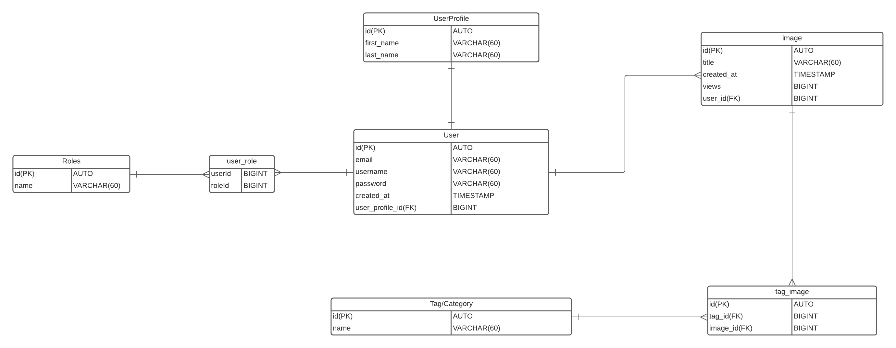

# Image API:
## Description:
This project is an API that involves creating images. It uses PostgresSQL for a relational database that contains data created and used by the 
API endpoints. REST API was created using Spring. My idea was to make an API that allows users to create images, and add tags to them. Other user users 
would be able to view but not edit images that are not contained within their own user account. There also would be roles so only certain trusted users like admins
had some control on the overall data. I also had the idea for users to have a list they can save other user created images to. Also, being able to share art, and make
copies that other users can save to edit freely.
## Use Cases:
- [x] As an unregistered user I want to be able to sign up

- Given that I am a unregistered user when I sign up the system should ask for information
and send a request to validate account creation.

- [ ] As a logged in user I want to be able to post a new item for others to see.

- [ ] As a logged in user I want to be able to delete images that I have created.

- [x] As a user I want to be able to add new tags to the images I create.

- [x] As a user I want to be able to create new tags that don't exist yet for my images.

- [x] As a user I want to be able to create a user profile.

- [x] As a user I want to be able to update my user profile.

- [x] As a user I want to be able to view images created by other users.

- [ ] As a admin access to all available users should be present

- [ ] As a admin access to all available images and tags

- [ ] As a admin I should be able to edit information that user, images, and tags contain
## ERD Diagram:

## Endpoints:
|Request Type|URL|Body|Header|Description|Access|
|---|---|---|---|---|---|
|POST|/api/auth/users/register/|username, email, password, createdAt|none|creates new user|Public|
|POST|/api/auth/users/login/|email, password|JPA token|user login|Private|
|POST|/api/tags/|name|none|creates new tag|Public|
|GET|/api/tags/|none|none|get all tags|Public|
|GET|/api/tags/{tagId}/|none|none|get tag by tagId|Public|
|PUT|/api/tags/{tagId}/|name|none|update specified tag by id|Public|
|DELETE|/api/tags/{tagId}/|none|none|delete specified tag by id|Public|
|POST|/api/images/|title, createdAt, views|none|creates image|Public|
|GET|/api/images/|none|none|get all images|Public|
|GET|/api/images/{imageId}/|none|none|get specified image by id|Public|
|PUT|/api/images/{imageId}/|title, views|none|update specified image|Public|
|DELETE|/api/images/{imageId}/|none|none|delete specified image by id|Public|
|POST|/api/images/{imageId}/tags/{tagId}/|none|none|adds new tag to image|Public|
|POST|/api/user/{userId}/image/{imageId}/|none|none|add user to image|Public|
|POST|/api/user/profile/|firstName, lastName|none|creates new user profile|Public|
|POST|/api/user/{userId}/profile/{profileId}/|none|none|adds user profile to user|Public|
|PUT|/api/user/profile/{profileId}/|firstName, lastName|none|updates specified user profile by id|Public|
|DELETE|/api/user/profile/{profileId}/|none|none|deletes user profile by id|Public|
|GET|/api/user/{userId}/|none|none|gets specified user by id|Public|
## Problems
The biggest problem I ran into was JPA tokens. The users were supposed to be authenticated by a JPA token, as well as have roles for different access 
levels. When trying to authenticate a user in the login endpoint I would always get a 403 forbidden response. Currently the problem is not resolved.
I believe that I setup the token creation correctly, and have the correct endpoints in the security config. I think it might have something to do with 
authorization. That's why most of the API endpoints the involve using a user are public so that I could use and test them.
## Future
